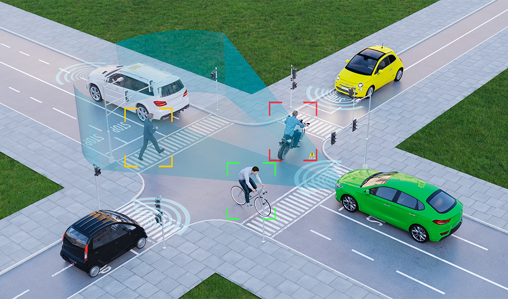

# Repositorio de Visión por Computadora

</img>

Welcome to the Computer Vision repository! Here, you will find a variety of projects related to Computer Vision, an exciting field that combines image processing and machine learning to analyze, understand, and visually interpret the world around us.

## Jupyter - Notebooks

In this repository, you will find the following:

### Getting-Started 

 - [1. Getting Started with Open CV.ipynb](https://github.com/JavierAM01/Computer-Vision/blob/main/Getting-Started/1.%20Getting%20Started%20with%20Open%20CV.ipynb)
 - [2. Face Detection.ipynb](https://github.com/JavierAM01/Computer-Vision/blob/main/Getting-Started/2.%20Face%20Detection.ipynb)
 - [3 . Face Recognition.ipynb](https://github.com/JavierAM01/Computer-Vision/blob/main/Getting-Started/3%20.%20Face%20Recognition.ipynb)

### Image-Classification

 - [Playing with Resnet-50.ipynb](https://github.com/JavierAM01/Computer-Vision/blob/main/Image-Classification/Playing%20with%20Resnet-50.ipynb)

## Repositories

| Preview | About |
|---------|-------|
| 

 | **:boom: Image classification with CNNs :boom:** This project serves as an introduction to PyTorch and Weights & Biases (wandb) by implementing and experimenting with deep learning models for image and text classification. The primary objectives include understanding PyTorch’s computation graphs, implementing a basic classifier, logging experiments with wandb, and modifying the baseline model to enhance performance. 
<a href="https://github.com/JavierAM01/PyTorch-Foundations-Image-Text-Classification">See details</a>
 |
| 

 | **:boom: Image generation with Diffusion models :boom:** This project explores different generative models for image synthesis, including Convolutional Neural Networks (CNNs), Encoder-only Transformers, Generative Adversarial Networks (GANs), and Denoising Diffusion Probabilistic Models (DDPMs). 
<a href="https://github.com/JavierAM01/Small_Difussion_Model">See details</a>
 |

